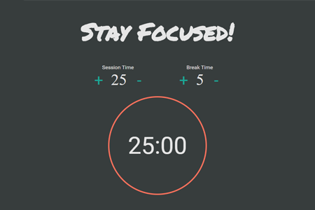
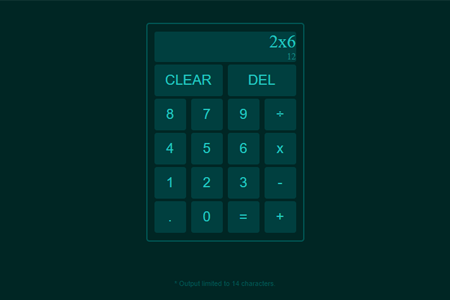
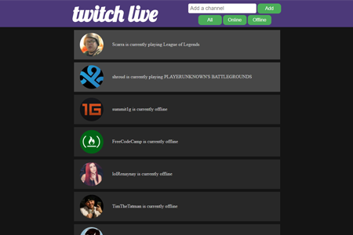
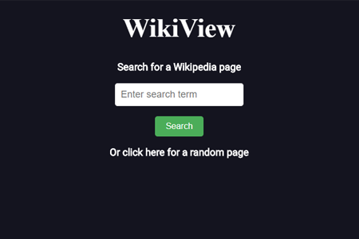
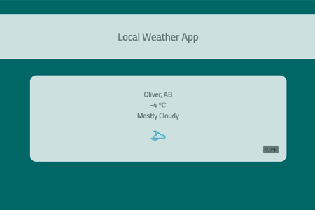

# freeCodeCamp-Projects-OLD
freeCodeCamp updated their curriculum on 05/20/2018, adding new projects and changing requirements of existing projects. These are all the older projects I completed with the oudated requirements.

## Pomodoro Clock

[View on CodePen](https://codepen.io/ChewyDinosaur/full/YEEVVO/)

## Calculator

[View on CodePen.](https://codepen.io/ChewyDinosaur/full/gXWrYr/)

## Twitch Live

[View on CodePen.](https://codepen.io/ChewyDinosaur/full/owxPjj/)

## Wikipedia Viewer

[View on CodePen.](https://codepen.io/ChewyDinosaur/full/VWYvXy/)

## Local Weather App

[View on CodePen.](https://codepen.io/ChewyDinosaur/full/pRxEvK/)

## Quote Generator

[View on CodePen.](https://codepen.io/ChewyDinosaur/full/BpxeyN/)

